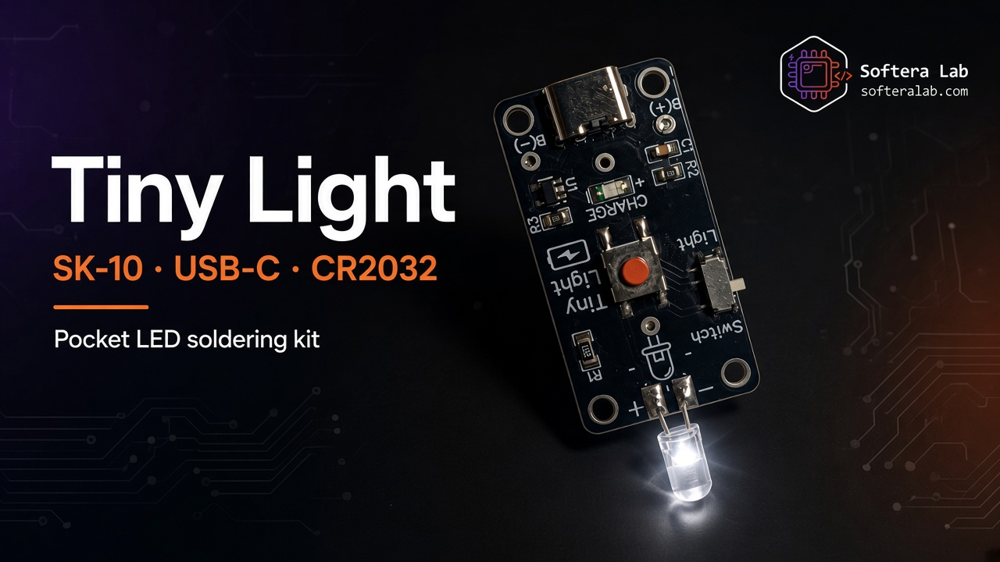
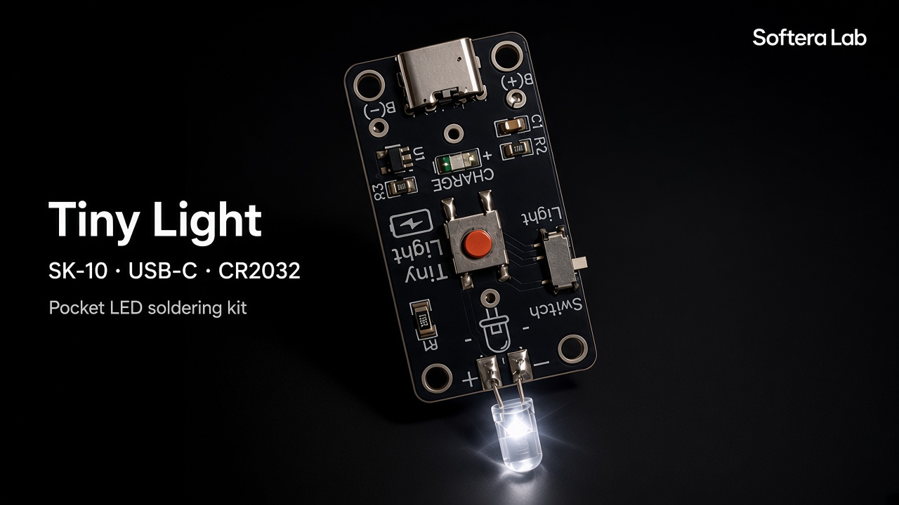
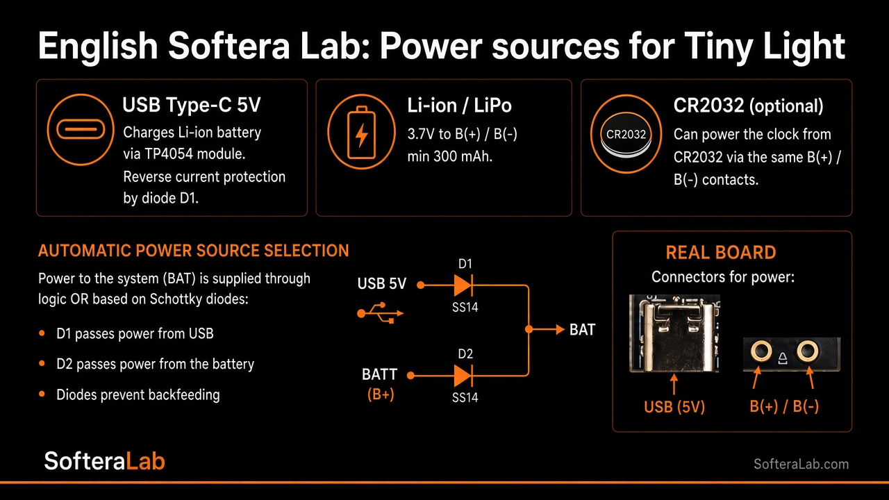
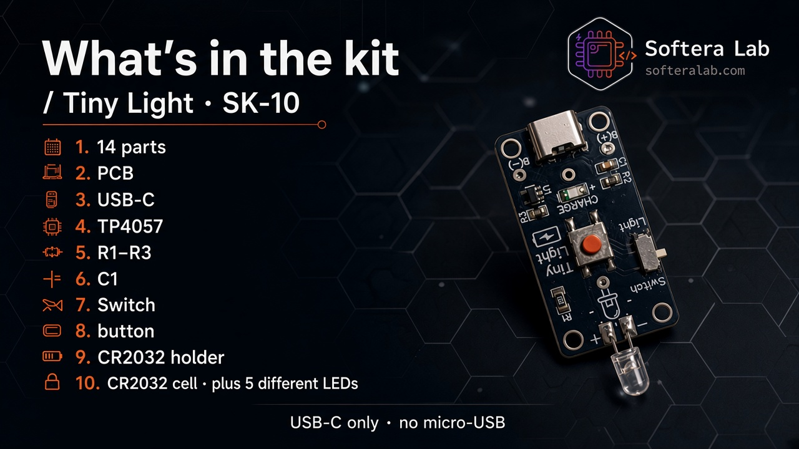
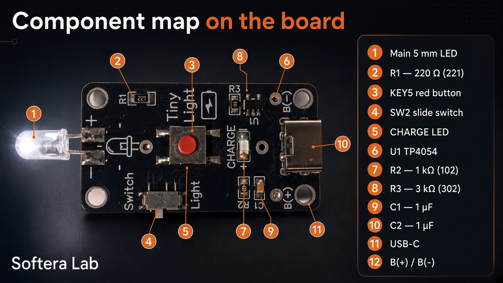
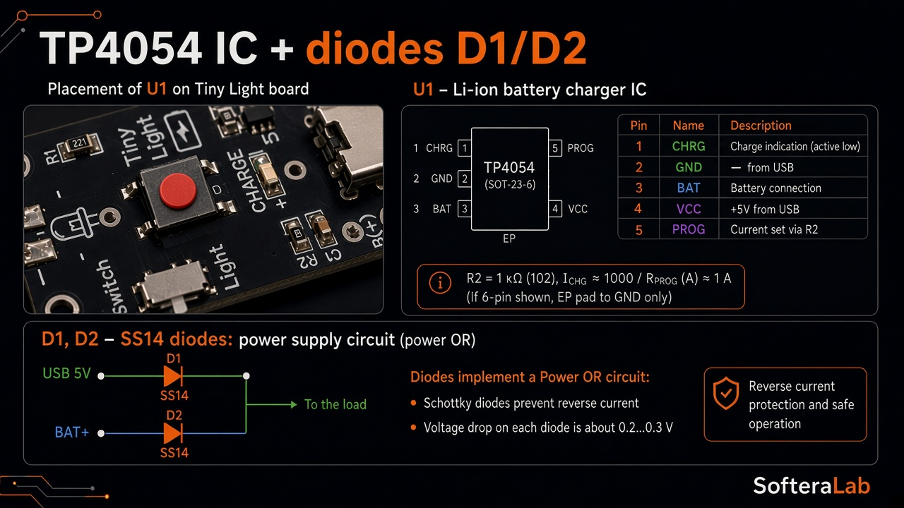
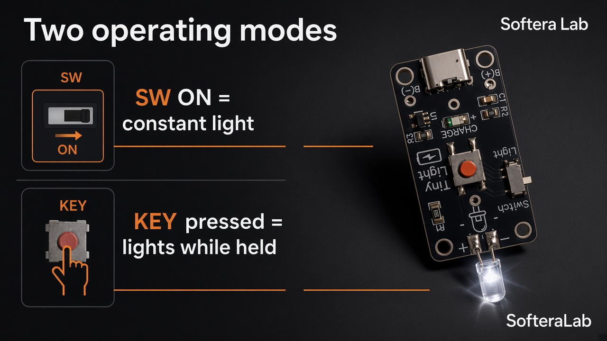



  

<h1 align="center">Tiny Light · SK-10</h1>

<strong>Softera Lab soldering kit — pocket LED light · USB-C · CR2032</strong>

  
  
  
  
  

<strong>Languages:</strong> English (this page) · <a href="README.uk.md">Українська</a>

  

**Tiny Light · SK-10** is a compact Softera Lab soldering kit: after assembly you get a pocket LED light with a modern **USB-C** charge port, **TP4054** charge IC, power **Switch**, **Light** button, and a **5 mm** LED.

It runs from **three power sources**: **USB-C**, a **CR2032** coin cell (included), or a **Li-ion / LiPo** pack on pads **B(+) / B(−)**.

This repository is a **product page and assembly guide**. It is **not open-source hardware** — Gerbers and manufacturing files are not published.

> © Softera Lab. All rights reserved.

## How it works

   
  <em>Power path: USB-C / battery → Switch → Light button → 5 mm LED</em>

1. **USB-C** — power from the cable; charge via **TP4054 (U1)** with **CHARGE** LED  
2. **CR2032** — coin cell in the back holder (included)  
3. **Li-ion / LiPo** — optional pack on **B(+) / B(−)**  
4. **Switch** — power on / off  
5. **Light** button — control the main LED  
6. **LED (+ / −)** — through-hole **5 mm** (observe polarity)  

   
  <em>Assembled Tiny Light with the main LED on</em>

## Power sources

   
  <em>USB-C · CR2032 · Li-ion — automatic Power-OR via Schottky diodes D1/D2</em>

**D1 / D2** (SS14) let the board take power safely from **USB-C**, the **CR2032**, or a **Li-ion** pack without backfeeding between sources.

## About the kit

| Zone | What you get |
| --- | --- |
| **Light** | 5 mm LED pads with **+ / −** · **R1 220 Ω** (221) |
| **Controls** | Slide **Switch** · tactile **Light** button |
| **Charge** | **USB-C** · **U1 TP4054** · **CHARGE** · **R2 1 kΩ** · **R3 3 kΩ** · **C1/C2 1 µF** |
| **Power** | **USB-C** · **CR2032** (kit) · optional **Li-ion** on **B(+) / B(−)** |

No microcontroller — discrete charge + switch + LED circuit. Guides: [`docs/en/`](docs/en/).

   
  <em>Front — USB-C, TP4054, Switch, Light button, LED pads</em>

   
  <em>Back — CR2032 holder and SofteraLab marking</em>

## Specifications

| Parameter | Value |
| --- | --- |
| Product | Tiny Light · **SK-10** |
| Charge port | **USB-C** |
| Charge IC | **TP4054** (U1) |
| Protection | **D1 / D2** SS14 Schottky (Power-OR) |
| Power sources | **USB-C** · **CR2032** · **Li-ion / LiPo** |
| Battery in kit | **CR2032** |
| Main LED | Through-hole **5 mm** |
| Controls | Slide switch + push button |
| MCU | None |

## What's in the kit

   
  <em>14 parts + 5 practice LEDs</em>

**14 parts** + **5 LEDs of different types** (practice / spare), including: PCB **SK-10**, **USB-C**, **TP4054**, **R1–R3**, **C1/C2**, **CHARGE** LED, **Switch**, **Light** button, **CR2032** holder and cell, main **5 mm** LED.

## Assembly (short)

1. SMD passives **R1–R3**, **C1**, **C2**  
2. **U1 TP4054** and **CHARGE** LED  
3. **USB-C**  
4. **Switch** and **Light** button  
5. Main **5 mm** LED (**+ / −**)  
6. **CR2032** holder on the back · insert cell  
7. **Switch** on → **Light** → LED on  

Full order: [docs/en/02-getting-started.md](docs/en/02-getting-started.md).

## Learning cards

   
  <em>Component map — where each part sits on the board</em>

   
  <em>TP4054 pinout and Schottky diodes D1/D2 (Power-OR)</em>

   
  <em>Two modes: Switch ON for constant light, or hold KEY</em>

   
  <em>Soldering the USB-C connector — order of pads</em>

   
  <em>Battery wiring — red to B(+), black to B(−)</em>

## Guides

| Guide | Link |
| --- | --- |
| Hardware overview | [docs/en/01-hardware-overview.md](docs/en/01-hardware-overview.md) |
| Getting started | [docs/en/02-getting-started.md](docs/en/02-getting-started.md) |
| Soldering | [docs/en/03-soldering.md](docs/en/03-soldering.md) |
| Troubleshooting | [docs/en/04-troubleshooting.md](docs/en/04-troubleshooting.md) |

## Links

| | |
| --- | --- |
| Website | [softeralab.com](https://www.softeralab.com/) |
| Soldering course | [course page](https://www.softeralab.com/course-basic-soldering/) |
| Contact | [Contacts](https://www.softeralab.com/our-contacts/) · support@softeralab.com |
| Instagram | [instagram.com/softeralab](https://www.instagram.com/softeralab/) |
| YouTube | [YouTube @SofteraLab](https://www.youtube.com/@SofteraLab) |

---

© Softera Lab. All rights reserved. See [COPYRIGHT.md](COPYRIGHT.md).
