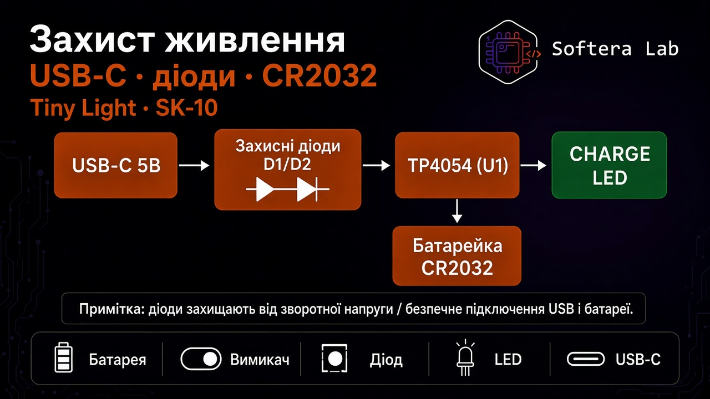
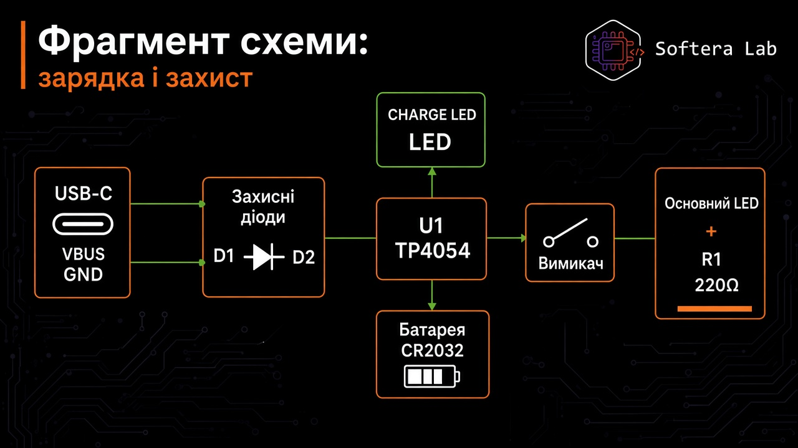
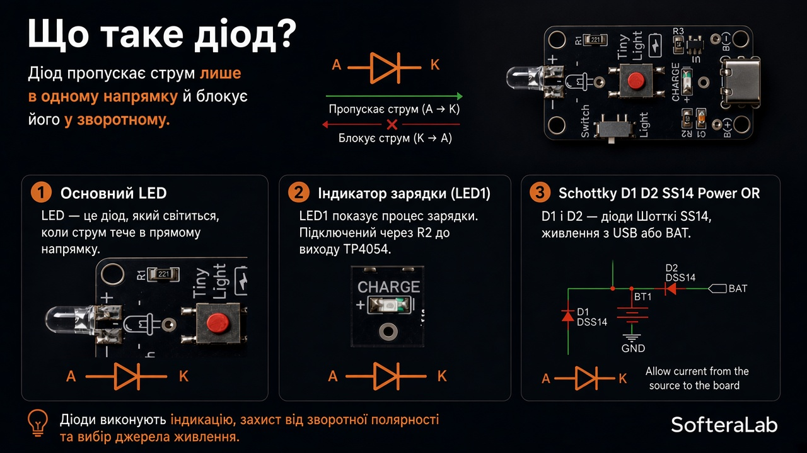



  

<h1 align="center">Tiny Light · SK-10</h1>

<strong>Набір Softera Lab — кишеньковий LED-ліхтарик · зарядка USB-C · CR2032</strong>

  
  
  
  
  

<strong>Мови:</strong> <a href="README.md">English</a> · Українська (ця сторінка)

  

**Tiny Light · SK-10** — компактний набір Softera Lab для пайки: після збірки отримуєте маленький LED-ліхтарик із портом **USB-C**, зарядним контролером **TP4054**, вимикачем **Switch**, кнопкою **Light** і світлодіодом **5 мм**.

Може працювати від **трьох джерел живлення**: **USB-C**, батарейки **CR2032** (у комплекті) або **акумулятора Li-ion / LiPo** на площадках **B(+) / B(−)**.

Це **сторінка продукту та інструкція**. Це **не open-source hardware** — Gerber і виробничі файли публічно не викладаються.

> © Softera Lab. All rights reserved.

## Як працює

  

1. **USB-C** — живлення від кабелю та шлях зарядки через **TP4054 (U1)**; індикатор **CHARGE**  
2. **CR2032** — батарейка (у комплекті) у тримачі на тилі  
3. **Li-ion / LiPo** — опційний акумулятор на **B(+) / B(−)**  
4. **Switch** — увімкнення / вимкнення  
5. Кнопка **Light** — керування основним LED  
6. **LED (+ / −)** — наскрізний **5 мм** (слідкуйте за полярністю)  

  

## Захист живлення

  

Захисні діоди (**D1 / D2**, Schottky **SS14**) утворюють **Power-OR**: ліхтарик може брати живлення від **USB-C**, батарейки **CR2032** або **акумулятора Li-ion**, зі захистом від зворотного струму — щоб джерела працювали безпечно разом.

  

Фрагмент схеми: **USB-C → D1/D2 → TP4054 → батарея**, плюс **Switch / Light** і основний LED з **R1 220 Ω**.

## Про набір

| Зона | Що отримуєте |
| --- | --- |
| **Світло** | Площадки LED **5 мм** з **+ / −** · обмежувач **R1 220 Ω** (221) |
| **Керування** | Слайдер **Switch** · тактова кнопка **Light** |
| **Зарядка** | **USB-C** · **U1 TP4054** · **CHARGE** · **R2 1 кОм** · **R3 3 кОм** · **C1/C2 1 µF** |
| **Живлення** | **USB-C** · **CR2032** (у наборі) · опційний **Li-ion** на **B(+) / B(−)** |
| **Практика** | SMD-пасиви, зарядний IC, USB-C, кнопка, вимикач, THT LED |

**Мікроконтролера немає** — дискретна схема зарядки + вимикач + LED.

Покроково: [`docs/`](docs/).

  

  

## Характеристики

| Параметр | Значення |
| --- | --- |
| Product | Tiny Light · **SK-10** |
| Порт зарядки | лише **USB-C** |
| Зарядний IC | **TP4054** (U1) |
| Захист | **D1 / D2** SS14 Schottky (Power-OR) |
| Джерела живлення | **USB-C** · **CR2032** · **Li-ion / LiPo** на **B(+) / B(−)** |
| Батарея в наборі | **CR2032** |
| Основний LED | Наскрізний **5 мм** |
| Керування | Слайдер + кнопка |
| МК | Немає |

## Що в наборі

  

**14 деталей** + **5 світлодіодів різних типів** (практика / запас).

Серед 14 позицій:

1. Плата Tiny Light (**SK-10**)  
2. Роз’єм **USB-C**  
3. Зарядний IC **TP4054** (U1)  
4. Резистори **R1 220 Ω** · **R2 1 кОм** · **R3 3 кОм** (коди 221 / 102 / 302)  
5. Конденсатори **C1 · C2** — по **1 µF**  
6. Індикатор **CHARGE**  
7. Слайдер **Switch**  
8. Кнопка **Light**  
9. Тримач **CR2032**  
10. Елемент **CR2032**  
11. Основний LED **5 мм** і решта з комплекту **14 деталей**  

Плюс у коробці **5 різних LED** для експериментів і тренування полярності.

## Збірка (коротко)

1. Припаяйте SMD **R1–R3**, **C1**, **C2**  
2. Припаяйте **U1 TP4054** і LED **CHARGE**  
3. Припаяйте **USB-C**  
4. Припаяйте **Switch** і кнопку **Light**  
5. Припаяйте основний LED **5 мм** (**+ / −**)  
6. Встановіть тримач **CR2032** на тил · вставте елемент  
7. **Switch** увімк → **Light** → світить  

Повний порядок: [docs/02-getting-started.md](docs/02-getting-started.md).

## Навчальні картки

  

  

  

  

  

  

  

## Інструкції

| Гайд | Посилання |
| --- | --- |
| Огляд плати | [docs/01-hardware-overview.md](docs/01-hardware-overview.md) |
| Старт | [docs/02-getting-started.md](docs/02-getting-started.md) |
| Пайка | [docs/03-soldering.md](docs/03-soldering.md) |
| Пошук несправностей | [docs/04-troubleshooting.md](docs/04-troubleshooting.md) |

## Посилання

| | |
| --- | --- |
| Сайт | [softeralab.com](https://www.softeralab.com/) |
| Курс пайки | [сторінка курсу](https://www.softeralab.com/course-basic-soldering/) |
| Контакт | [Контакти](https://www.softeralab.com/our-contacts/) · support@softeralab.com |
| Instagram | [instagram.com/softeralab](https://www.instagram.com/softeralab/) |
| YouTube | [YouTube @SofteraLab](https://www.youtube.com/@SofteraLab) |

---

© Softera Lab. All rights reserved. Див. [COPYRIGHT.md](COPYRIGHT.md).
