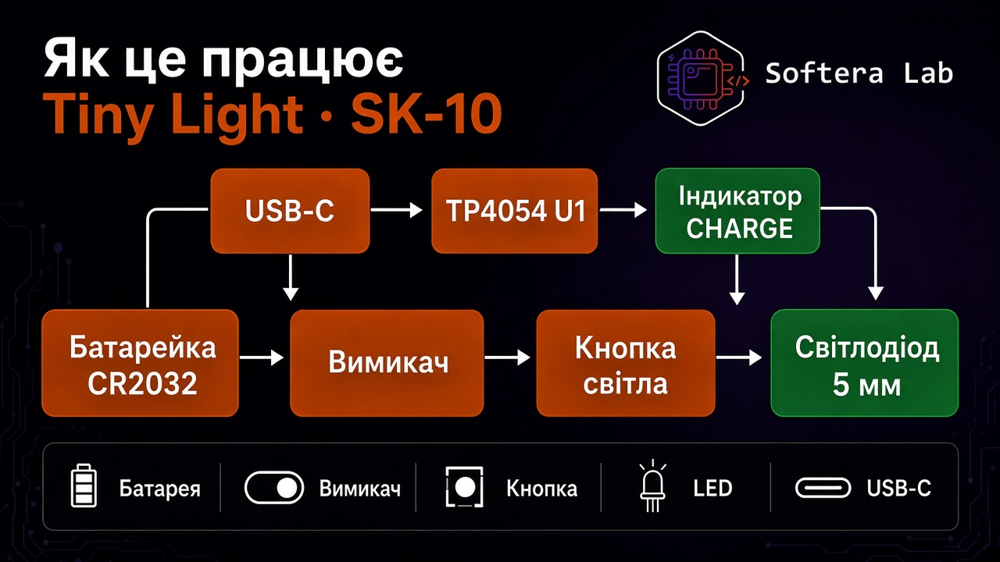
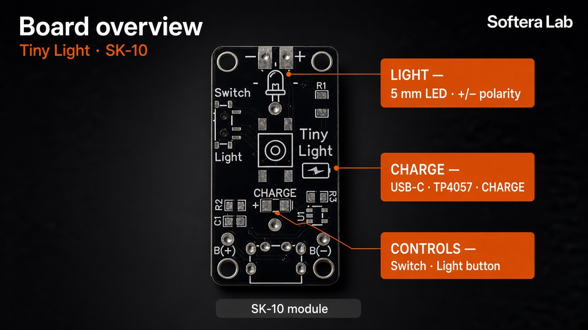
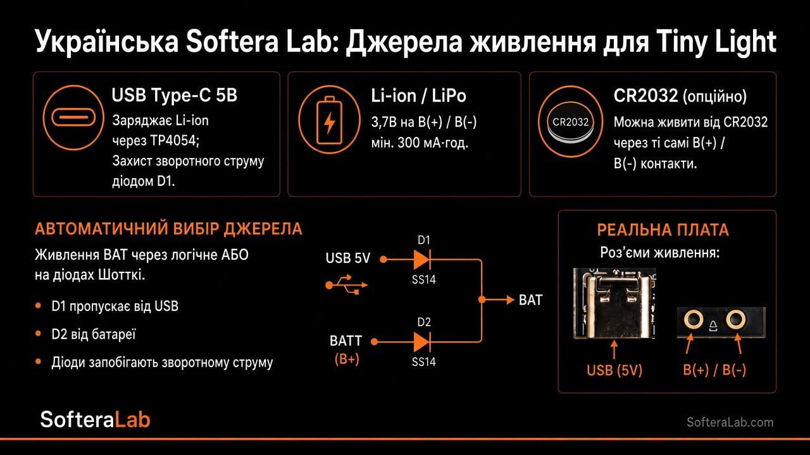

# Огляд плати

**Tiny Light · SK-10** — компактна плата Softera Lab для пайки кишенькового LED-ліхтарика.

Працює від **USB-C**, батарейки **CR2032** або **акумулятора Li-ion / LiPo** (площадки **B(+) / B(−)**).

| Зона | Вміст |
| --- | --- |
| LED | Наскрізний **5 мм**, мітки **+ / −** |
| Light | Тактова кнопка |
| Switch | Слайдер живлення |
| CHARGE | Індикатор зарядки |
| U1 | **TP4054** |
| USB-C | Порт зарядки |
| D1 / D2 | Schottky **SS14** (Power-OR) |
| B(+) / B(−) | Батарейка **CR2032** або акумулятор **Li-ion** |
| Тил | Тримач **CR2032**, брендинг SofteraLab |
| Пасиви | **R1 220 Ω** · **R2 1 кОм** · **R3 3 кОм** · **C1/C2 1 µF** |

МК на платі немає.
