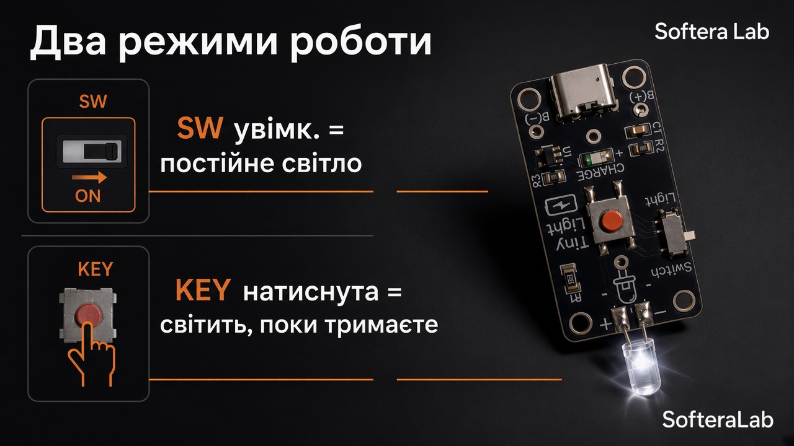

# Старт

## Порядок збірки

1. SMD-пасиви **R1, R2, R3, C1, C2**  
2. **U1 TP4054** і LED **CHARGE**  
3. Роз’єм **USB-C**  
4. **Switch** і кнопка **Light**  
5. Основний LED **5 мм** (полярність **+ / −**)  
6. Тримач **CR2032** на тилі · вставити елемент  
7. Увімкнути **Switch** → натиснути **Light**  

- **SW ON** — постійне світло  
- **KEY** натиснута — світить, поки тримаєте  

## У комплекті

- **14 деталей**  
- **5 світлодіодів різних типів**  
- Батарейка **CR2032** у комплекті  
- Порт зарядки **USB-C**

## Джерела живлення

Ліхтарик може працювати від:

1. **USB-C** — живлення від кабелю  
2. **CR2032** — батарейка в тримачі  
3. **Li-ion / LiPo** — акумулятор на **B(+) / B(−)**
