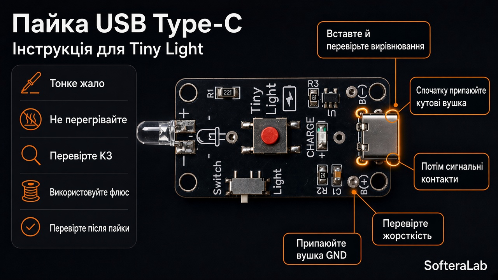
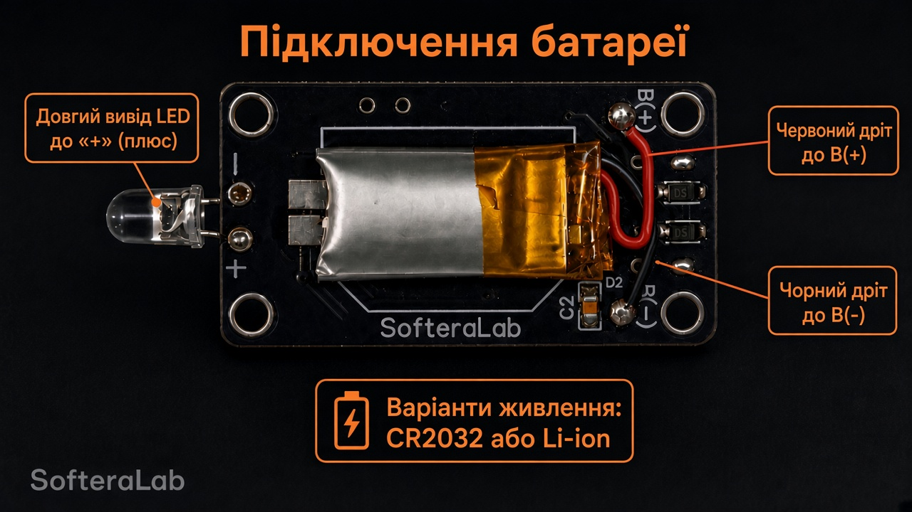

# Пайка

- Починайте з дрібних SMD (**R**, **C**, **U1**), далі USB-C, механіка, LED.  
- **U1 TP4054** — орієнтація pin 1 за шовкографією; без містків між ніжками.  
- **USB-C** — рівно по краю плати, усі контакти пропаяні.  
- LED **5 мм** — довша ніжка зазвичай **анод (+)**; на платі є мітки **+ / −**.  
- **R1 221** = **220 Ω** — обмежувач струму основного LED.  
- **R2 102** = **1 кОм**, **R3 302** = **3 кОм**.  
- **C1 · C2** = **1 µF**.  
- Тримач **CR2032** — на тилі; полярність за **+ / −** на шовкографії.  
- Дроти батареї: **червоний → B(+)**, **чорний → B(−)**.
