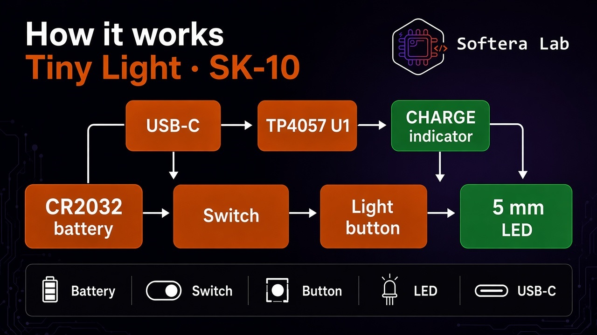
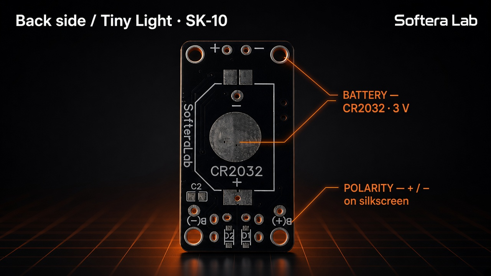
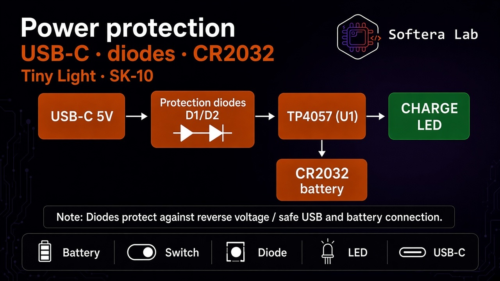
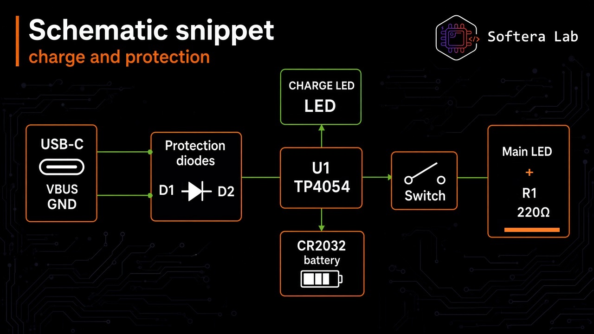

# Hardware overview

**Tiny Light · SK-10** is a compact Softera Lab board for building a pocket LED light.

It can run from **USB-C**, a **CR2032** coin cell, or a **Li-ion / LiPo** pack on pads **B(+) / B(−)**.

| Zone | Content |
| --- | --- |
| LED | Through-hole **5 mm**, **+ / −** marks |
| Light | Tactile button |
| Switch | Power slide switch |
| CHARGE | Charge indicator |
| U1 | **TP4054** |
| USB-C | Charge port (USB-C only in this kit) |
| D1 / D2 | Schottky **SS14** (Power-OR) |
| B(+) / B(−) | **CR2032** cell or **Li-ion** pack |
| Back | **CR2032** holder, SofteraLab marking |
| Passives | **R1 220 Ω** · **R2 1 kΩ** · **R3 3 kΩ** · **C1/C2 1 µF** |

No microcontroller on the board.
