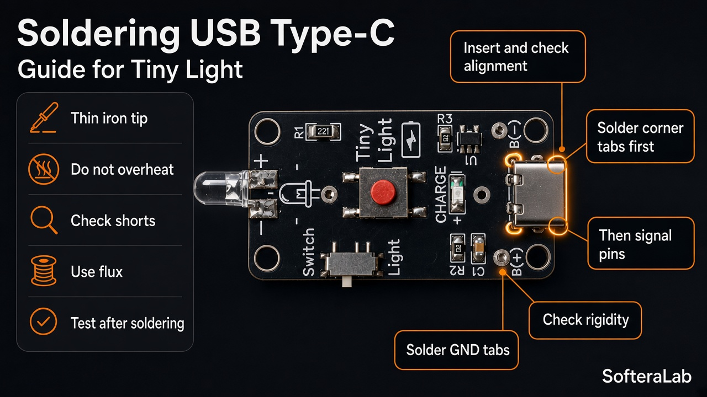
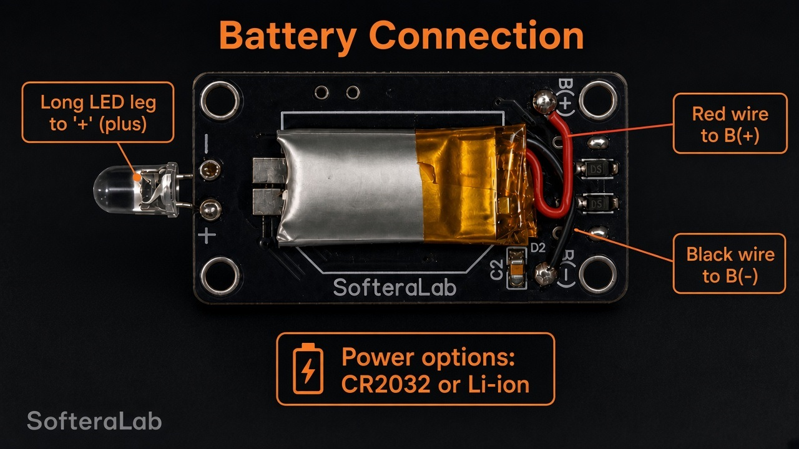

# Soldering

- Start with small SMD (**R**, **C**, **U1**), then USB-C, mechanics, LED.  
- **U1 TP4054** — match pin 1 to silkscreen; clear bridges.  
- **USB-C** — flush to the board edge; all pins soldered.  
- **5 mm** LED — longer lead is usually anode (**+**); board has **+ / −**.  
- **R1 221** = **220 Ω** — main LED current limit.  
- **R2 102** = **1 kΩ**, **R3 302** = **3 kΩ**.  
- **C1 · C2** = **1 µF**.  
- **CR2032** holder — on the back; follow **+ / −** silkscreen.  
- Battery wires: **red → B(+)**, **black → B(−)**.
